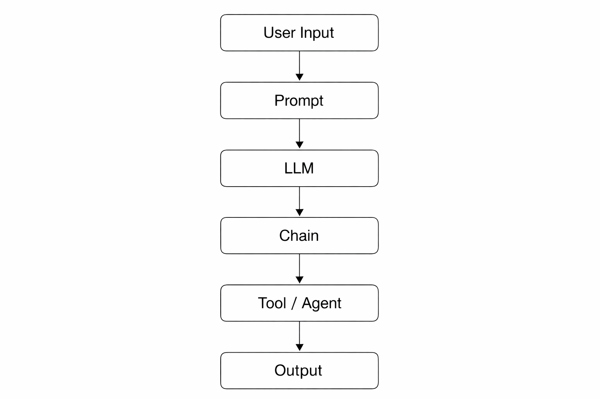

# 🚀 LangChain Prompt Engine (GenAI Project)

This project demonstrates how to build **dynamic and reusable prompt systems** using LangChain, replacing traditional hardcoded prompts with structured and scalable prompt templates.

---

## 📌 Overview

In real-world Generative AI applications, prompts should not be static or manually written every time.  
This project focuses on designing a **modular prompt engine** that can generate structured prompts dynamically based on user inputs.

---

## 🎯 Objectives

- Replace hardcoded prompts with reusable templates  
- Build flexible prompt systems using LangChain  
- Understand how structured prompting improves AI outputs  
- Design scalable prompt pipelines  

---

## ⚙️ Key Features

- 🔹 PromptTemplate for dynamic prompt creation  
- 🔹 Multi-input prompts (topic, audience, tone)  
- 🔹 Prompt variations (teaching, interview, storytelling)  
- 🔹 ChatPromptTemplate with role-based design  
- 🔹 Input validation for robust prompt handling  
- 🔹 Prompt generator function  
- 🔹 Template reusability testing  

---

## 🧠 Core Concepts

- Prompt Engineering  
- Dynamic Prompt Generation  
- Modular Design in GenAI  
- Role-based Prompting  
- Input Validation  

---

## 🔄 Architecture Flow

User Input → Prompt → LLM → Chain → Tool/Agent → Output  

---

## 💻 Example

### Input:
- Topic: Neural Networks  
- Audience: Beginner  
- Tone: Fun  
- Style: Storytelling  

### Output:
Explain Neural Networks for beginners in a fun storytelling style  

---

## 🛠️ Tech Stack

- Python  
- LangChain  
- Jupyter Notebook  

---
## 📂 Project Structure
├── notebook/
│ └── langchain_prompt_engine.ipynb
├── diagrams/
│ └── Architecture1.png
├── requirements.txt
└── README.md

---

## 📈 Learning Outcomes

- Designed reusable prompt systems instead of static prompts  
- Built flexible and structured prompt pipelines  
- Understood role-based prompting and multi-input handling  
- Improved prompt engineering skills for real-world applications  

---

## 🚫 Limitations

- Focused on prompt design (not full LLM deployment)  
- No real-time production integration  

---

## 🚀 Future Improvements

- Integrate real LLM APIs (OpenAI / HuggingFace)  
- Build a UI using Streamlit  
- Extend with memory and agent-based workflows  

---

## 🙏 Acknowledgment

Grateful to **Innomatics Research Labs** for the guidance and learning opportunity.

---

## 👤 Author

**Md Javeed Khan**  
📧 mdjaveedkhanofficial@gmail.com  
🌐 https://mdjaveedkhan.me
## 📂 Project Structure
